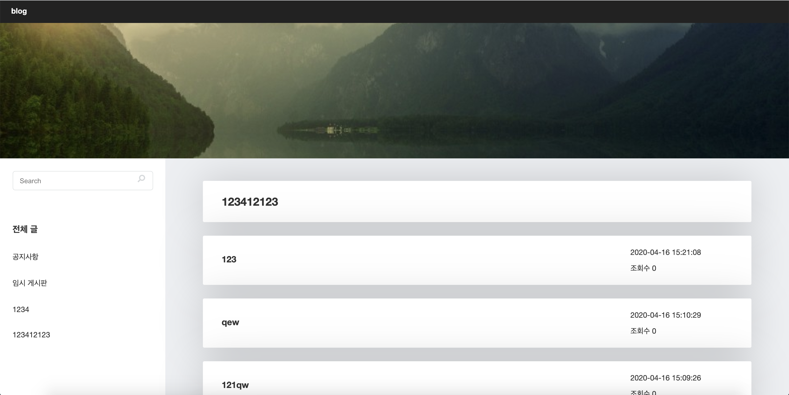

# React-Blog

## 개발환경 및 소개
* React,Redux 와 NodeJS를 이용해 개인용 블로그 개발

## 설정
### 1. blog-temp.sql을 이용하여 데이터베이스 테이블 생성
### 2. /react-blog/server/routes/api/account.js 데이터베이스 연결 정보 입력

## 실행
~~~
npm install

cd server

npm run dev
~~~

## 구현내역
* 사용자 게시글 읽기
* 게시판 구현
* 댓글 및 대댓글 작성, 수정, 삭제
* 로그인 및 회원가입
* 관리자 페이지 게시글 작성, 수정, 삭제
* 게시판 추가, 수정, 삭제

## 스크린샷

